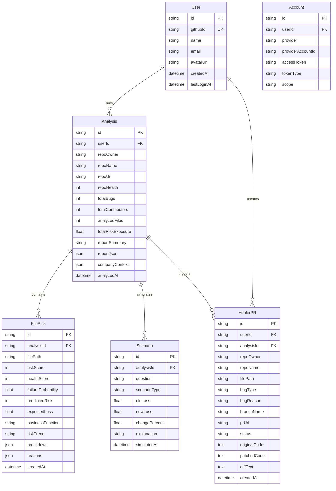

# CEOfriend — Database Model & Schema

## Overview

CEOfriend currently runs entirely in-memory — every analysis, scenario simulation, and healer patch is regenerated per session. Adding a database layer will:

1. **Persist analysis reports** so CEOs don't wait 30–60s on repeat visits.
2. **Track healer PR history** for audit trails and dashboards.
3. **Store scenario simulations** so users can compare "what-if" results over time.
4. **Link everything to authenticated users** (GitHub OAuth via NextAuth).

**Recommended Stack:** Prisma ORM + SQLite (for hackathon speed; swap to PostgreSQL for production).

---

## Entity-Relationship Diagram



---

## Table Schemas (Prisma)

### 1. `User` — Authenticated GitHub Users

Populated automatically by NextAuth on first login.

| Column        | Type       | Notes                              |
|---------------|------------|------------------------------------|
| `id`          | `String`   | CUID, primary key                  |
| `githubId`    | `String`   | Unique GitHub user ID              |
| `name`        | `String?`  | Display name from GitHub           |
| `email`       | `String?`  | Primary email (can be private)     |
| `avatarUrl`   | `String?`  | GitHub avatar URL                  |
| `createdAt`   | `DateTime` | Auto-set on first login            |
| `lastLoginAt` | `DateTime` | Updated each session               |

**Why:** Links all platform activity to a specific GitHub identity. Required for PR attribution and access control.

---

### 2. `Account` — NextAuth OAuth Tokens

Managed entirely by NextAuth's Prisma adapter.

| Column             | Type       | Notes                              |
|--------------------|------------|------------------------------------|
| `id`               | `String`   | CUID, primary key                  |
| `userId`           | `String`   | FK → `User.id`                     |
| `provider`         | `String`   | Always `"github"`                  |
| `providerAccountId`| `String`   | GitHub user ID (string)            |
| `accessToken`      | `String?`  | OAuth access token for API calls   |
| `tokenType`        | `String?`  | `"bearer"`                         |
| `scope`            | `String?`  | `"read:user,user:email,repo"`      |

**Why:** NextAuth needs this table to persist OAuth tokens across sessions. Without it, users must re-authenticate on every server restart.

---

### 3. `Analysis` — Repository Analysis Results

One row per "Analyze" button click. Stores the full pipeline output.

| Column             | Type       | Notes                                      |
|--------------------|------------|---------------------------------------------|
| `id`               | `String`   | CUID, primary key                           |
| `userId`           | `String`   | FK → `User.id` (who ran the analysis)       |
| `repoOwner`        | `String`   | e.g. `"facebook"`                           |
| `repoName`         | `String`   | e.g. `"react"`                              |
| `repoUrl`          | `String`   | Full GitHub URL                             |
| `repoHealth`       | `Int`      | 0–100, from `riskAgent`                     |
| `totalBugs`        | `Int`      | From `repoAgent` summary                    |
| `totalContributors`| `Int`      | From `repoAgent` summary                    |
| `analyzedFiles`    | `Int`      | Count of hotspot files analyzed             |
| `totalRiskExposure`| `Float`    | ₹ value from `impactAgent`                  |
| `reportSummary`    | `String`   | LLM-generated CEO summary text              |
| `reportJson`       | `Json`     | Full `Report` object (keyRisks, recs, etc.) |
| `companyContext`   | `Json?`    | Optional `CompanyContext` if provided       |
| `analyzedAt`       | `DateTime` | Timestamp of analysis                       |

**Why:** This is the heaviest operation (30–60s). Caching here means instant re-visits and historical comparisons.

**Indexes:**
- `(userId, repoOwner, repoName)` — fast lookup of past analyses for a repo
- `analyzedAt DESC` — recent analyses first

---

### 4. `FileRisk` — Per-File Risk & Impact Data

One row per analyzed file per analysis. Denormalized for query speed.

| Column              | Type       | Notes                                       |
|---------------------|------------|----------------------------------------------|
| `id`                | `String`   | CUID, primary key                            |
| `analysisId`        | `String`   | FK → `Analysis.id`                           |
| `filePath`          | `String`   | e.g. `"src/services/payment.ts"`             |
| `riskScore`         | `Int`      | 0–100, from `riskAgent`                      |
| `healthScore`       | `Int`      | 100 - riskScore                              |
| `failureProbability`| `Float`    | 0.0–1.0, from `predictionAgent`              |
| `predictedRisk`     | `Int`      | Predicted future risk score                  |
| `expectedLoss`      | `Float`    | ₹ value, from `impactAgent`                  |
| `businessFunction`  | `String`   | e.g. `"Revenue Generation"`                  |
| `riskTrend`         | `String`   | `"increasing"` / `"stable"` / `"decreasing"` |
| `breakdown`         | `Json`     | `RiskBreakdown` object                       |
| `reasons`           | `Json`     | Array of human-readable reason strings       |
| `createdAt`         | `DateTime` | Auto-set                                     |

**Why:** The dashboard renders per-file cards with scores, trends, and reasons. Storing these avoids re-running 4 agents on every page load.

**Indexes:**
- `analysisId` — fetch all files for an analysis
- `(analysisId, riskScore DESC)` — sorted risk view

---

### 5. `Scenario` — What-If Simulations

One row per scenario question asked by the CEO.

| Column          | Type       | Notes                                        |
|-----------------|------------|-----------------------------------------------|
| `id`            | `String`   | CUID, primary key                             |
| `analysisId`    | `String`   | FK → `Analysis.id`                            |
| `question`      | `String`   | Raw CEO question, e.g. "What if we delay fix?" |
| `scenarioType`  | `String`   | Parsed type: `delay_fix`, `traffic_spike`, etc.|
| `oldLoss`       | `Float`    | ₹ baseline loss                               |
| `newLoss`       | `Float`    | ₹ projected loss after scenario               |
| `changePercent` | `Float`    | % change in expected loss                     |
| `explanation`   | `String`   | LLM-generated explanation                     |
| `simulatedAt`   | `DateTime` | When the simulation was run                   |

**Why:** CEOs ask multiple "what-if" questions per session. Storing them enables a scenario history timeline and trend analysis.

---

### 6. `HealerPR` — Autonomous Fix & PR History

One row per "Raise PR" action from the Healer page.

| Column          | Type       | Notes                                        |
|-----------------|------------|-----------------------------------------------|
| `id`            | `String`   | CUID, primary key                             |
| `userId`        | `String`   | FK → `User.id` (who authorized the PR)        |
| `analysisId`    | `String?`  | FK → `Analysis.id` (optional link)            |
| `repoOwner`     | `String`   | Repository owner                              |
| `repoName`      | `String`   | Repository name                               |
| `filePath`      | `String`   | File that was patched                         |
| `bugType`       | `String`   | e.g. `"null_pointer"`, `"off_by_one"`         |
| `bugReason`     | `String`   | Human-readable explanation of the bug         |
| `branchName`    | `String`   | Created branch name                           |
| `prUrl`         | `String`   | Full GitHub PR URL                            |
| `status`        | `String`   | `"opened"` / `"merged"` / `"closed"`         |
| `originalCode`  | `Text`     | Original file content (for audit)             |
| `patchedCode`   | `Text`     | Fixed file content                            |
| `diffText`      | `Text`     | Generated diff output                         |
| `createdAt`     | `DateTime` | When the PR was created                       |

**Why:** Full audit trail of every autonomous fix. Essential for compliance, rollback, and showing judges "here are all the PRs our AI created."

**Indexes:**
- `userId` — all PRs by a user
- `(repoOwner, repoName)` — all PRs for a repo
- `status` — filter by open/merged/closed

---

## Prisma Schema (Copy-Paste Ready)

```prisma
// prisma/schema.prisma

generator client {
  provider = "prisma-client-js"
}

datasource db {
  provider = "sqlite"
  url      = env("DATABASE_URL")
}

// ── NextAuth Models ──────────────────────────────────

model User {
  id          String   @id @default(cuid())
  githubId    String   @unique
  name        String?
  email       String?
  avatarUrl   String?
  createdAt   DateTime @default(now())
  lastLoginAt DateTime @default(now())

  accounts  Account[]
  analyses  Analysis[]
  healerPRs HealerPR[]
}

model Account {
  id                String  @id @default(cuid())
  userId            String
  provider          String
  providerAccountId String
  accessToken       String?
  tokenType         String?
  scope             String?

  user User @relation(fields: [userId], references: [id], onDelete: Cascade)

  @@unique([provider, providerAccountId])
}

// ── Core Domain Models ───────────────────────────────

model Analysis {
  id                String   @id @default(cuid())
  userId            String
  repoOwner         String
  repoName          String
  repoUrl           String
  repoHealth        Int
  totalBugs         Int
  totalContributors Int
  analyzedFiles     Int
  totalRiskExposure Float
  reportSummary     String
  reportJson        String   // JSON string (SQLite has no native JSON)
  companyContext     String?  // JSON string
  analyzedAt        DateTime @default(now())

  user      User       @relation(fields: [userId], references: [id], onDelete: Cascade)
  fileRisks FileRisk[]
  scenarios Scenario[]
  healerPRs HealerPR[]

  @@index([userId, repoOwner, repoName])
  @@index([analyzedAt])
}

model FileRisk {
  id                 String   @id @default(cuid())
  analysisId         String
  filePath           String
  riskScore          Int
  healthScore        Int
  failureProbability Float
  predictedRisk      Int
  expectedLoss       Float
  businessFunction   String
  riskTrend          String
  breakdown          String   // JSON string
  reasons            String   // JSON string (array)
  createdAt          DateTime @default(now())

  analysis Analysis @relation(fields: [analysisId], references: [id], onDelete: Cascade)

  @@index([analysisId])
  @@index([analysisId, riskScore])
}

model Scenario {
  id            String   @id @default(cuid())
  analysisId    String
  question      String
  scenarioType  String
  oldLoss       Float
  newLoss       Float
  changePercent Float
  explanation   String
  simulatedAt   DateTime @default(now())

  analysis Analysis @relation(fields: [analysisId], references: [id], onDelete: Cascade)

  @@index([analysisId])
}

model HealerPR {
  id           String   @id @default(cuid())
  userId       String
  analysisId   String?
  repoOwner    String
  repoName     String
  filePath     String
  bugType      String
  bugReason    String
  branchName   String
  prUrl        String
  status       String   @default("opened")
  originalCode String
  patchedCode  String
  diffText     String
  createdAt    DateTime @default(now())

  user     User      @relation(fields: [userId], references: [id], onDelete: Cascade)
  analysis Analysis? @relation(fields: [analysisId], references: [id], onDelete: SetNull)

  @@index([userId])
  @@index([repoOwner, repoName])
  @@index([status])
}
```

---

## Environment Variable

Add to `.env`:
```env
DATABASE_URL="file:./dev.db"
```

---

## Setup Commands

```bash
npm install prisma @prisma/client
npx prisma init --datasource-provider sqlite
# Copy the schema above into prisma/schema.prisma
npx prisma db push
npx prisma generate
```

---

## Data Flow Summary

```
User clicks "Analyze"
    │
    ├─► repoAgent → riskAgent → predictionAgent → impactAgent → reportAgent
    │                                                                │
    │   ┌────────────────────────────────────────────────────────────┘
    │   │
    ▼   ▼
  ┌─────────┐     ┌──────────┐
  │ Analysis │────►│ FileRisk │  (one per hotspot file)
  └─────────┘     └──────────┘
       │
       ├──► Scenario  (each "what-if" question)
       │
       └──► HealerPR  (each "Raise PR" click)
```

---

## What This Enables (Future Features)

| Feature                  | Tables Used                    |
|--------------------------|-------------------------------|
| Dashboard History        | `Analysis` + `FileRisk`        |
| "Show me my past reports"| `Analysis` filtered by userId  |
| PR Audit Trail           | `HealerPR`                     |
| Scenario Comparison      | `Scenario` grouped by analysis |
| Risk Trend Over Time     | `FileRisk` across analyses     |
| User Profile Page        | `User` + `Analysis` count      |
